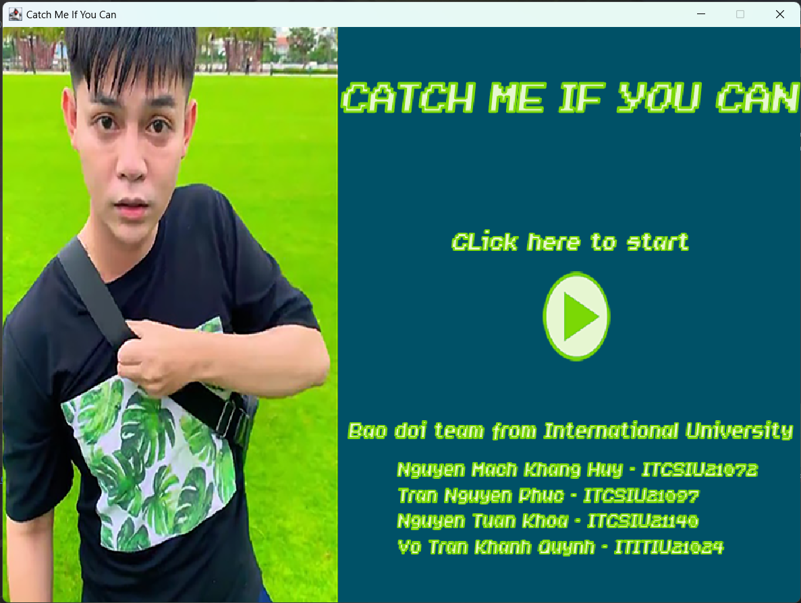
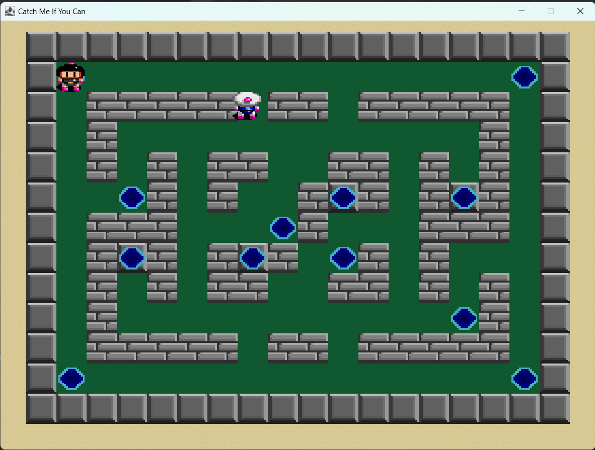
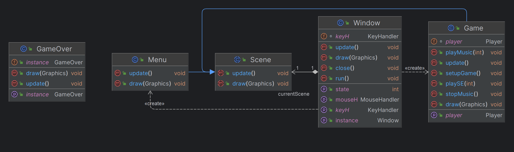
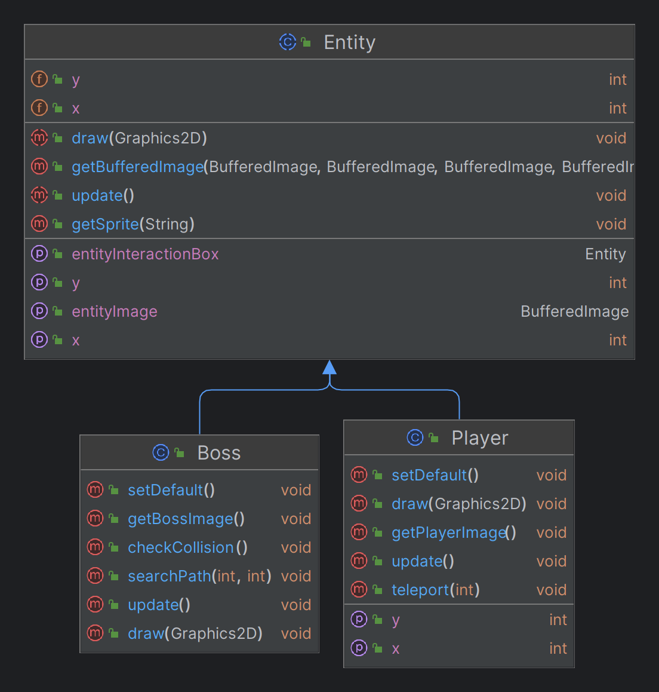
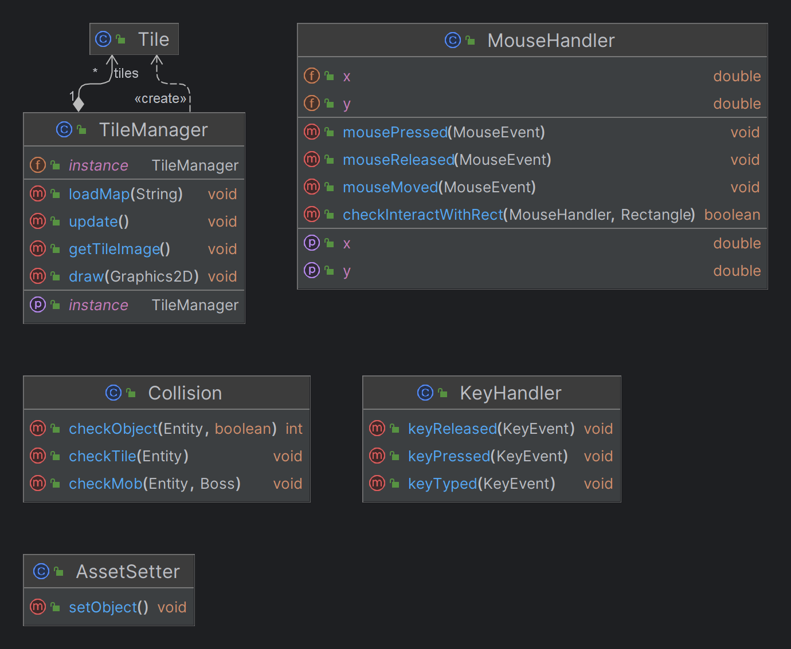
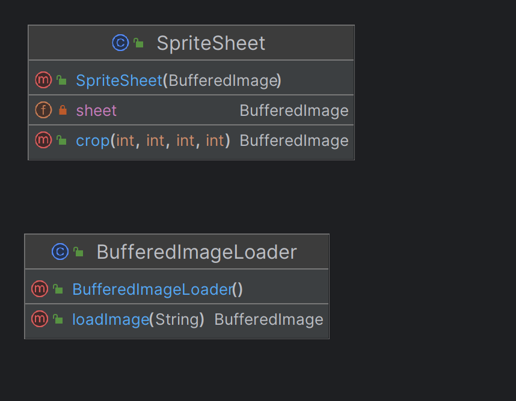
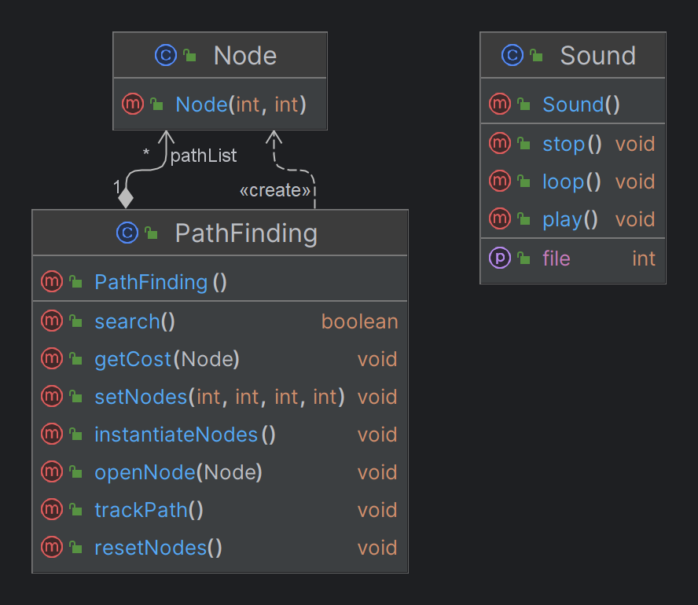
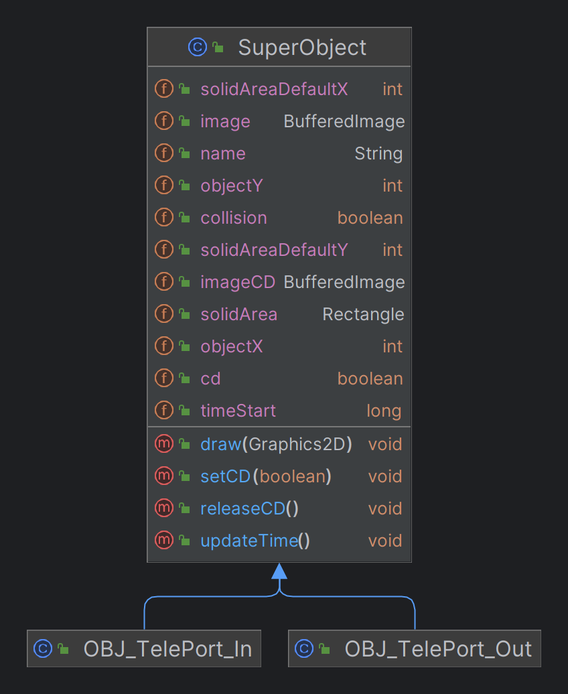
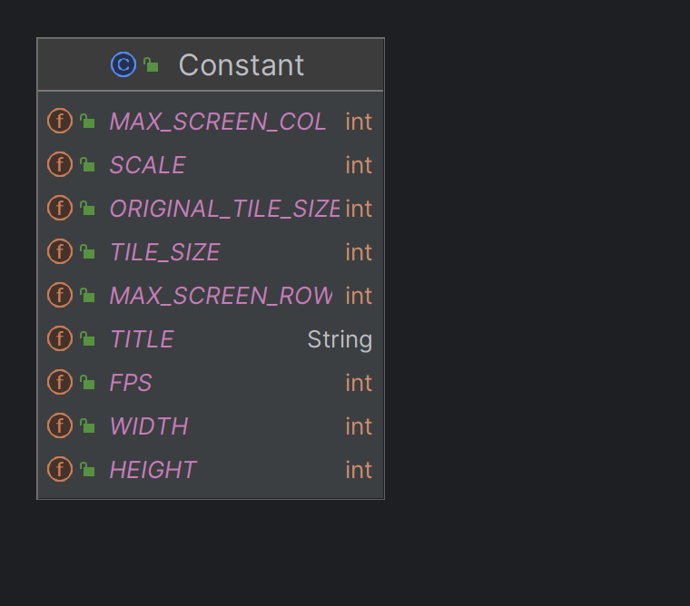

[![Contributors][contributors-shield]][contributors-url]
[![Forks][forks-shield]][forks-url]
[![Stargazers][stars-shield]][stars-url]
[![Issues][issues-shield]][issues-url]
# Catch-Me-If-You-Can

<!--suppress ALL -->
<div align="center">

</div>

<!-- TABLE OF CONTENTS -->
1. [Introduction](#Introduction)
2. [Game](#Game)
3. [UML-diagram](#UML-diagram)
4. [Features](#Features)
5. [Challenges](#Challenges)

<!-- <details>
<summary>Table of Contents</summary>
<ol>
    <li>
        <a href="#Introduction">Introduction</a>
        <ul>
            <li><a href="#Team-Members">Team Members</a></li>
            <li><a href="#How-to-Run">How to Run</a></li>
            <li><a href="#Task-Allocation">Task Allocation</a></li>
        </ul>
    </li>
    <li>
        <a href="#Game">Game</a>
        <ul>
            <li><a href="#About-the-Game">About the Game</a></li>
            <li><a href="#Controls">Controls</a></li>
            <li><a href="#Items">Items</a></li>
        </ul>
    </li>
    <li><a href="#UML-diagram">UML-diagram</a></li>
    <li><a href="#Features">Features</a></li>
    <li><a href="#Challenges">Challenges</a></li>
</ol>
</details> -->

<!-- ABOUT THE PROJECT -->
## Introduction <a name="Introduction"></a>
<div style = "text-align: justify">
Based on the classic tag game that many people played when they were children, this game is a tag game created in Java.
Our team's purpose is to produce an entertaining game that uses the knowledge that we learnt in the course DSA.
</div>

### Team Members
| Order |         Name          | Student ID  |
|:-----:|:---------------------:|:-----------:|
|   1   |   Tran Nguyen Phuc    | ITCSIU21097 |
|   2   | Nguyen Mach Khang Huy | ITCSIU21072 |
|   3   |   Nguyen Tuan Khoa    | ITCSIU21140 |
|   4   |  Vo Tran Khanh Quynh  | ITITIU21024 |

### How to Run

### How to run

1. Clone this repository
    ```sh
    git clone https://github.com/tnphucccc/Catch-Me-If-You-Can.git
    ```
2. Open the project with IntelliJ IDEA or VSCode and check the file status
    ```sh
    git status
    ```
3. Run the project
4. Enjoy the game

### Task Allocation

| Order |         Name          | Student ID  |       Task Allocation       | Contribution |
|:-----:|:---------------------:|:-----------:|:---------------------------:|:------------:|
|   1   |   Tran Nguyen Phuc    | ITCSIU21097 | Algorithms, Sound, UML, git |     25%      |
|   2   | Nguyen Mach Khang Huy | ITCSIU21072 |   Objects, Debug, Design    |     25%      |
|   3   |   Nguyen Tuan Khoa    | ITCSIU21140 |    Algorithms, Entities     |     25%      |
|   4   |  Vo Tran Khanh Quynh  | ITITIU21024 |  Controls, Debug, Objects   |     25%      |

<!-- GAME -->
## Game <a name="Game"></a>

### About the Game
<div align="center">

</div>

- Language: [Java](https://www.java.com/en/)
- IDE: [IntelliJ IDEA](https://www.jetbrains.com/idea/)
- Library: [JavaSwing](https://docs.oracle.com/javase/7/docs/api/javax/swing/package-summary.html)
- Sound: [JavaSound](https://docs.oracle.com/javase/tutorial/sound/index.html)
- Game Engine: [Java2D](https://docs.oracle.com/javase/7/docs/api/java/awt/Graphics2D.html)

### Controls

|  Key  | Action |
|:-----:|:------:|
|  UP   |  Move  |
| DOWN  |  Move  |
| LEFT  |  Move  |
| RIGHT |  Move  |

<div style="text-align: justify">
The player is controlled by 4 arrows key. Players can move around by pressing those 4 keys to play the game.
</div>

<!-- UML-diagram -->
## UML-diagram <a name="UML-diagram"></a>
<div>
   <h3>Configuration</h3>
      <div align="center">
        
      </div>
   <br />
   <h3>Entities</h3>
        <div align="center">
            
        </div>
    <br />
    <h3>Controls and Utility</h3>
        <div align="center">
            
        </div>
    <br />
    <h3>Graphics</h3>
        <div align="center">
            
        </div>
    <br />
    <h3>Algorithm and Sound</h3>
        <div align="center">
            
        </div>
    <br />
    <h3>Objects</h3>
        <div align="center">
            
        </div>
    <br />
    <h3>Constant</h3>
        <div align="center">
            
        </div>
</div>

<!-- FEATURES -->
## Features <a name="Features"></a>


<!-- CHALLENGES -->
## Challenges <a name="Challenges"></a>


<p align="right">(<a href="#top">Back to top</a>)</p>

<!-- MARKDOWN LINKS & IMAGES -->
<!-- https://www.markdownguide.org/basic-syntax/#reference-style-links -->
[contributors-shield]: https://img.shields.io/github/contributors/tnphucccc/Catch-Me-If-You-Can.svg?style=for-the-badge
[contributors-url]: https://github.com/tnphucccc/Catch-Me-If-You-Can/graphs/contributors
[forks-shield]: https://img.shields.io/github/forks/tnphucccc/Catch-Me-If-You-Can.svg?style=for-the-badge
[forks-url]: https://github.com/tnphucccc/Catch-Me-If-You-Can/network/members
[stars-shield]: https://img.shields.io/github/stars/tnphucccc/Catch-Me-If-You-Can.svg?style=for-the-badge
[stars-url]: https://github.com/tnphucccc/Catch-Me-If-You-Can/stargazers
[issues-shield]: https://img.shields.io/github/issues/tnphucccc/Catch-Me-If-You-Can.svg?style=for-the-badge
[issues-url]: https://github.com/tnphucccc/Catch-Me-If-You-Can/issues